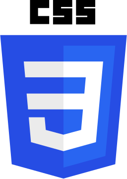
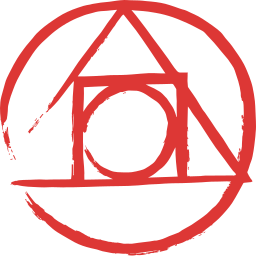

### Hi there 👋 
### This is Kaung Myat Kyaw!

Welcome to my Github page! I am Kaung Myat Kyaw and I am currently finishing MMSIT SWD COURSE!  

#### 🌱 Things I am currently working on: 
- Finish MMSIT SWD Course  
- Making Projects for practise 

#### :muscle: Things I am challenging myself with:
- Waking up earlier to make good use of the day
- Coding at least 4 hours a day
- Exercising 3 days a week
- Improving my CV and coding skill

#### :computer: Programming languages and tools: 

	

<code></code>
<code></code>
<code></code>
 
<code></code>
<code></code>
<code></code>
 
<code></code>
<code></code>
<code></code>
 
<code></code>
<code></code>

